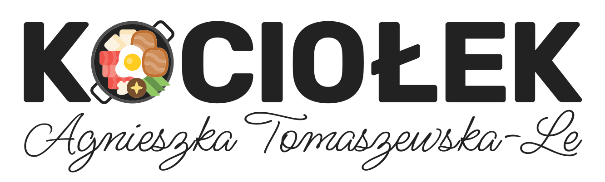
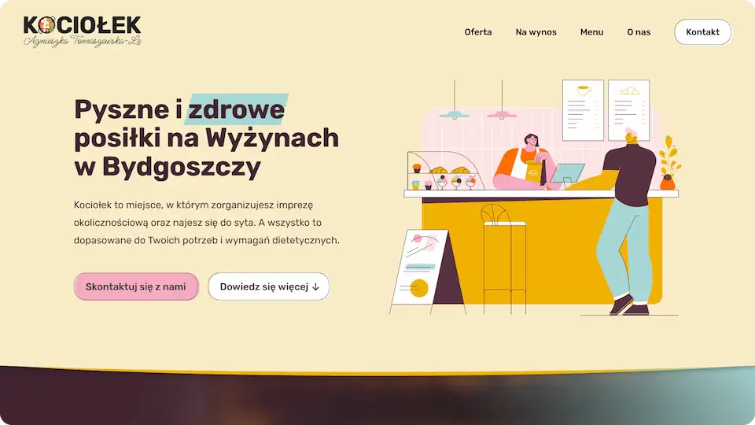
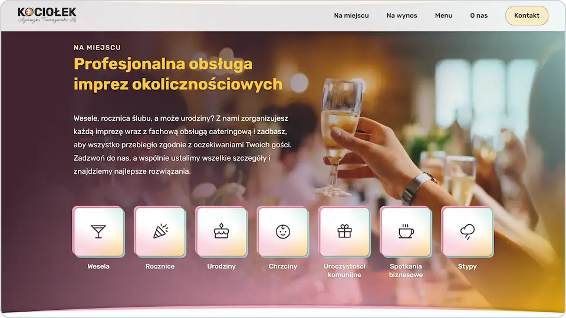
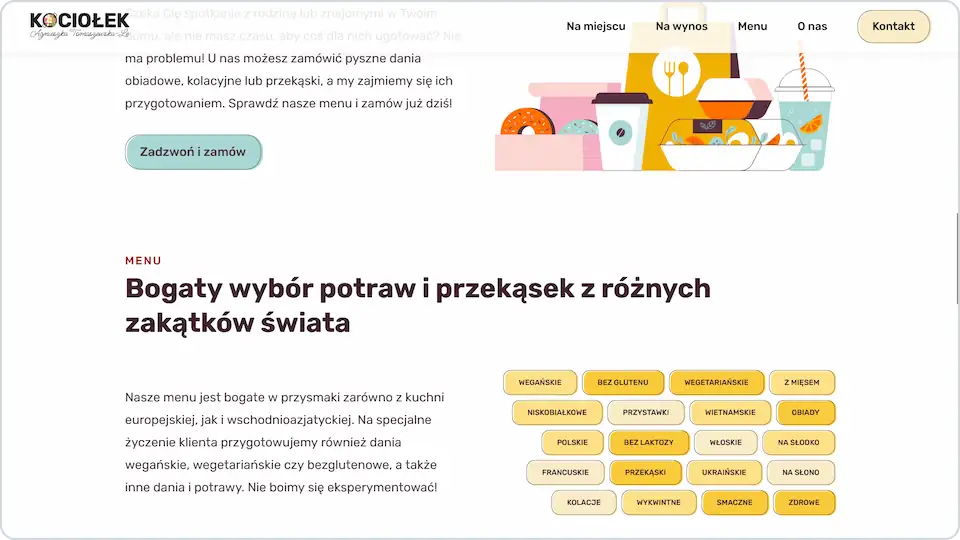
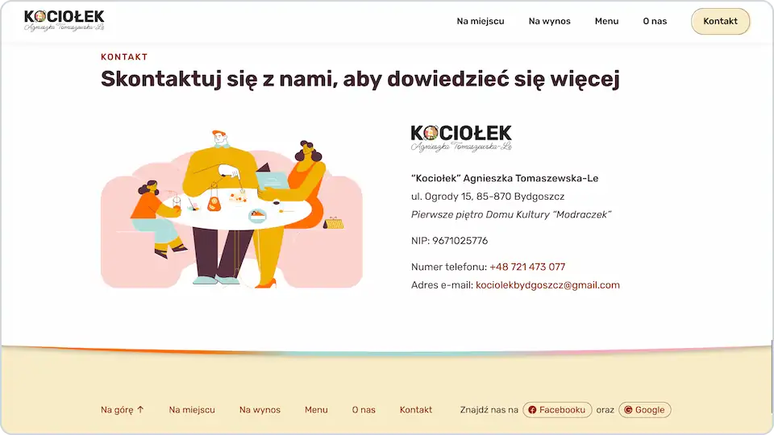

# 

**Home page of Kociołek - buffet and cafe in Bydgoszcz, Poland.**

This website was created for Kociołek company from scratch. I designed it by myself, including layout, colors, typography and overall appearance, as well as implemented some simple JS solutions. It is fully responsive and mobile-ready.

## 💻 Screenshots

## 🛠️ Tools and technologies
`HTML` `CSS` `JavaScript` `Parcel` `VS Code`

## 🌐 Deployment
This is the old version of the website and is not currently deployed, but the newest version is looking exactly the same and can be found under this link: [kociolekbydgoszcz.pl](https://kociolekbydgoszcz.pl/).
